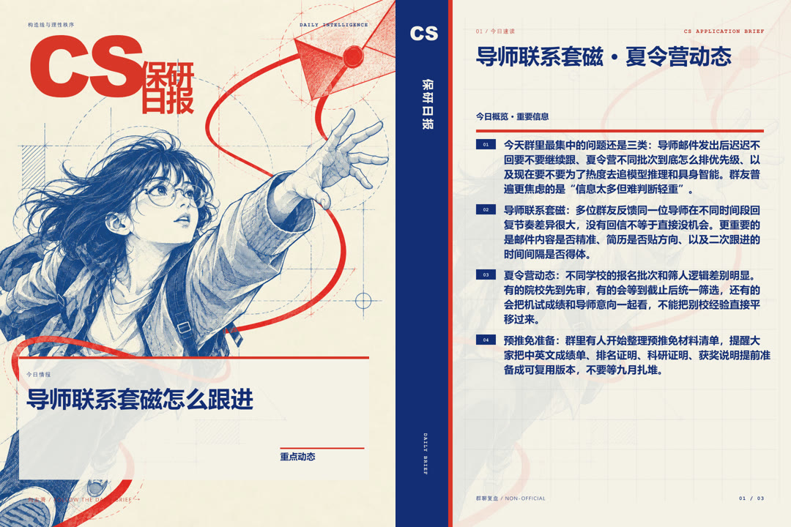
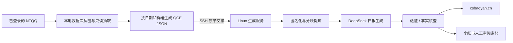

<div align="center">

# CS 保研日报

**把一天的 CS 保研群聊，整理成可检索、可核验、可发布的结构化日报。**

[](https://csbaoyan.cn)
[](https://www.python.org/)
[](LICENSE)

[在线阅读](https://csbaoyan.cn) · [部署与运维](docs/MAINTENANCE.md) · [技术改进](docs/IMPROVEMENTS.md) · [数据源原理](docs/optimize-export.md)

</div>



## 十套可轮换视觉系统

日报并非每天只替换标题和颜色。生产系统内置十套完整封面母版，在人物、动作、构图、字体关系和专色色板上分别建立识别度；不同日期稳定轮换，既保持账号统一感，也避免连续发布时视觉疲劳。


上图均为真实日报生成结果，从左到右依次为：

| # | 视觉模板与示例主题 | # | 视觉模板与示例主题 |
| --- | --- | --- | --- |
| 01 | **技术钢笔** · 清华结果前夜，鸽子链怎么接 | 06 | **折页播报员** · 浙大返名额引热议 |
| 02 | **展开今日信号** · 清华预推免已开 | 07 | **剪开噪音** · 复旦计智结果可查 |
| 03 | **开启情报窗** · 中山机试进行中 | 08 | **跃过节点** · 东南面试开打 |
| 04 | **翻动下一页** · 上交预推免开放 | 09 | **信号监听者** · 东南计软智今年太难 |
| 05 | **校准申请坐标** · 北航预推免说法不一 | 10 | **盖章归档员** · 预推免开奖撞车 |

人物插画是固定、可版本管理的美术资产；每天变化的标题、副标题、内容卡和分页由 SVG 确定性渲染。这样既保留插画封面的视觉冲击力，也不会依赖运行时随机生图，历史素材可以稳定复现。

## 为什么做这个项目

保研群里真正有价值的信息通常散落在数百条聊天中：报名节点、院校变化、导师回复、面试经验，以及尚未核实的传言。爬楼耗时，简单摘要又容易丢失条件和风险提示。

CS 保研日报把这条链路做成了可维护的自动化系统：从本人已登录的 NTQQ 本地数据库读取消息，匿名化并分块提炼，生成带来源边界的日报，再发布到网站并导出小红书人工审阅素材。

> 日报用于发现线索和整理行动项，不代替院校官方通知。所有关键时间、名额与考核安排都应回到官方渠道复核。

## 你会得到什么

| 能力 | 结果 |
| --- | --- |
| 本地 NTQQ 数据源 | 不创建第二个 QQ 登录会话，减少协议机器人带来的风控暴露 |
| 自动提炼 | 对长聊天分块处理，保留招生节点、经验观点和风险待核实项 |
| 质量检查 | 支持发布前验证、G-Eval 与事实核查流程，失败时停止发布旧数据 |
| 多端输出 | 同时生成网站日报、结构化 JSON，以及供管理员人工发布的小红书素材 |
| 确定性视觉 | 1080×1440 封面、内容卡与收尾卡由 SVG 渲染，文字可测量、可分页、可复现 |
| 可运维部署 | Windows 负责本地取数，Linux 负责生成与托管，链路可独立诊断和补跑 |

## 工作方式



这套架构把“必须在 Windows 上读取 NTQQ”的部分限制在边缘机器；服务器只接收当日交接文件。若输入缺失、过小、日期错误或生成失败，流水线会停止，不会把旧日报伪装成新日报。

## 与原项目的区别

本项目基于 [jielosc/csbaoyan-chat-daily](https://github.com/jielosc/csbaoyan-chat-daily) 继续开发，保留其脱敏、分块、AI 汇总和静态站流程，重点解决数据来源与长期运行问题。

| 维度 | 原始方案 | 本项目 |
| --- | --- | --- |
| 消息获取 | 通过协议框架建立额外会话 | 从本人已登录的 NTQQ 本地数据库读取 |
| 日常操作 | 依赖手动导出 | Windows 计划任务自动取数与交接 |
| 异常策略 | 依赖人工发现 | 新鲜度、消息量、时间覆盖与产物完整性检查 |
| 部署边界 | 单机为主 | Windows 数据源与 Linux 生成/托管解耦 |
| 内容出口 | 网站日报 | 网站日报 + 结构化导出 + 小红书人工发布素材 |

## 快速开始

### 1. 安装

```powershell
git clone https://github.com/cookiesheep/csbaoyan-ribao.git
cd csbaoyan-ribao
python -m venv .venv
.venv\Scripts\python.exe -m pip install -r requirements.txt
Copy-Item .env.example .env
$env:PYTHONPATH = "src"
```

在 `.env` 中配置本地数据库路径、目标群标识和 OpenAI 兼容模型服务。不要提交 API Key、解密后的聊天数据库或原始群聊导出。

### 2. 校准 NTQQ 数据结构

NTQQ 版本变化可能调整字段编号。首次运行先使用体检模式查看表结构和样本解码结果：

```powershell
.venv\Scripts\python.exe -m csbaoyan_daily.cli ingest --inspect --db-path <解密后的 nt_msg.db>
```

### 3. 导出并生成日报

```powershell
.venv\Scripts\python.exe -m csbaoyan_daily.cli ingest --date 2026-09-17
.venv\Scripts\python.exe -m csbaoyan_daily.cli pipeline --date 2026-09-17 --skip-push
```

生产环境的定时任务、SSH 交接、systemd 服务、Cloudflare 隧道和补跑流程见 [维护手册](docs/MAINTENANCE.md)。

## 设计原则

- **先保证来源边界。** 群聊推测必须标为待核实，不能改写成院校事实。
- **先保证数据新鲜。** 当日输入不完整时宁可停止，也不静默复用旧数据。
- **先保证隐私。** 原始群聊、解密库、密钥与个人联系方式不进入公开仓库和网页。
- **发布保留人工关口。** 系统生成小红书素材包，管理员审阅后手工发布，不接管平台账号。
- **视觉可以大胆，排版必须保守。** 正文按语义边界分页，不缩成难读的小字，也不裁掉溢出内容。

## 文档

- [部署与日常运维](docs/MAINTENANCE.md)：生产拓扑、定时任务、补跑与分层排障
- [技术改进说明](docs/IMPROVEMENTS.md)：本地取数、字段自适应和防御式读取
- [NTQQ 数据源原理](docs/optimize-export.md)：数据库解析与校准方法
- [原项目部署指南](docs/deploy-guide.md)：日报生成流程的基础配置
- [原项目停更背景](docs/pause-update.md)：为什么需要替换消息获取方式

## 安全与限制

- 本地数据库解密涉及平台服务条款边界，仅应用于你本人有权访问的数据，并遵守相关法律、群规与平台规则。
- 本地读取避免了额外协议登录会话，但任何方案都不应承诺“零风险”或“绝不封号”。
- 日报由 AI 辅助生成，可能遗漏上下文或产生错误归纳；生产流程必须保留验证与人工复核。
- 小红书素材不包含二维码、私人联系方式或自动发布能力。

## 路线图

- [ ] 强化跨版本 NTQQ 字段校准与回归样本
- [ ] 为数据缺口、延迟和异常消息量增加更直观的监控
- [ ] 扩充日报质量评估与可追溯引用
- [x] 完成小红书十套视觉模板的自动轮换与排版 QA
- [ ] 把生产部署整理成可复用的最小化安装流程

## 致谢

- [jielosc/csbaoyan-chat-daily](https://github.com/jielosc/csbaoyan-chat-daily)：原始日报生成、脱敏、发布与前端流程
- [CS-BAOYAN](https://github.com/CS-BAOYAN)：计算机保研社区生态
- [NapNeko/qq_dump_db](https://github.com/NapNeko/qq_dump_db)：NTQQ 本地数据库解密工具
- [QQBackup/qq-win-db-key](https://github.com/QQBackup/qq-win-db-key)：NTQQ 数据库字段研究
- [blackboxprotobuf](https://github.com/nccgroup/blackboxprotobuf)：protobuf 盲解析

## 参与贡献

欢迎提交 Issue 或 Pull Request，尤其是 NTQQ 新版本兼容、日报质量评估、隐私保护和部署可维护性方面的改进。如果这个项目对你有帮助，可以点一个 Star，让更多需要减少群聊信息负担的人找到它。

## License

[MIT](LICENSE)
